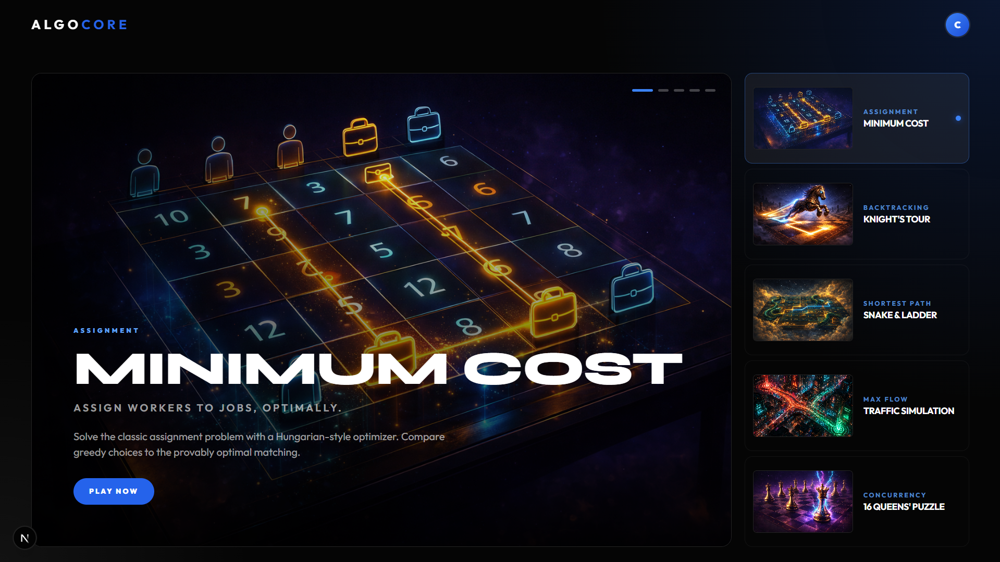
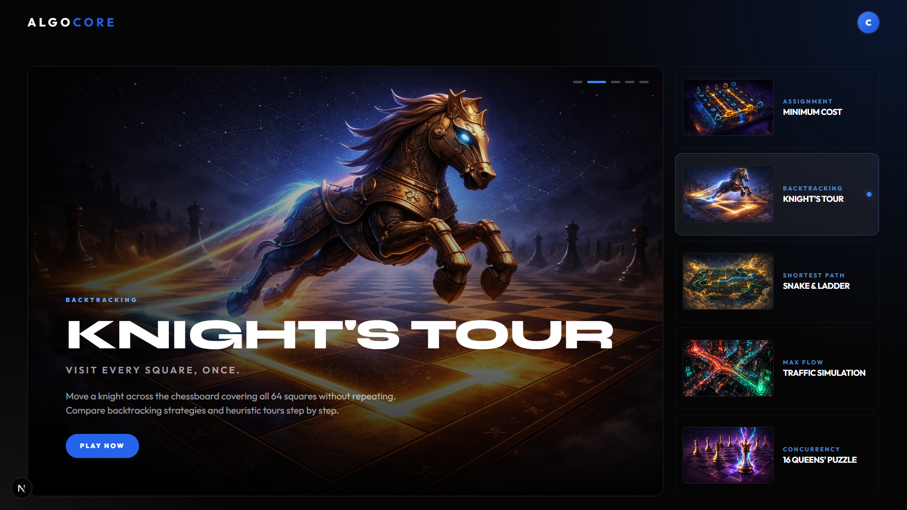
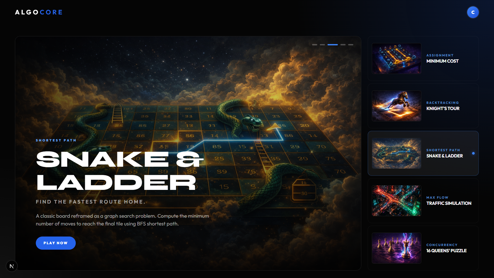
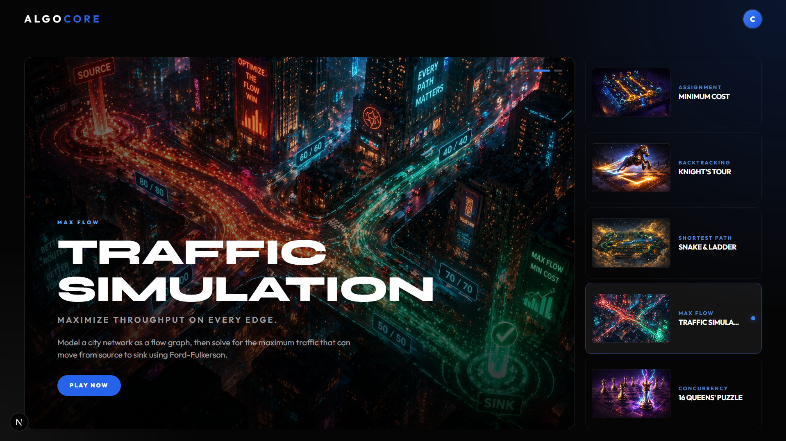
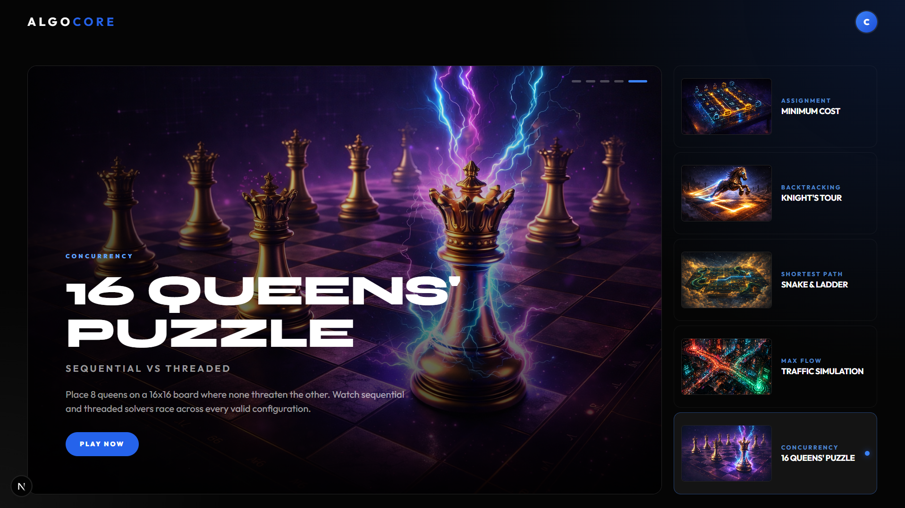
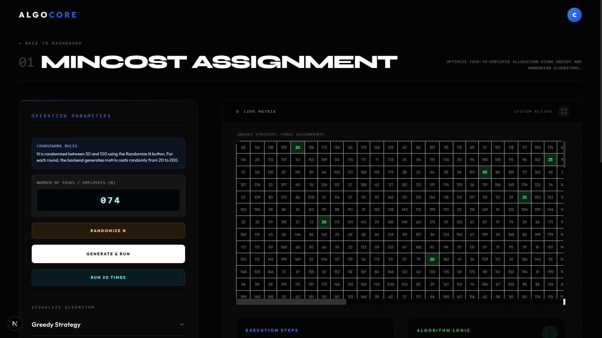
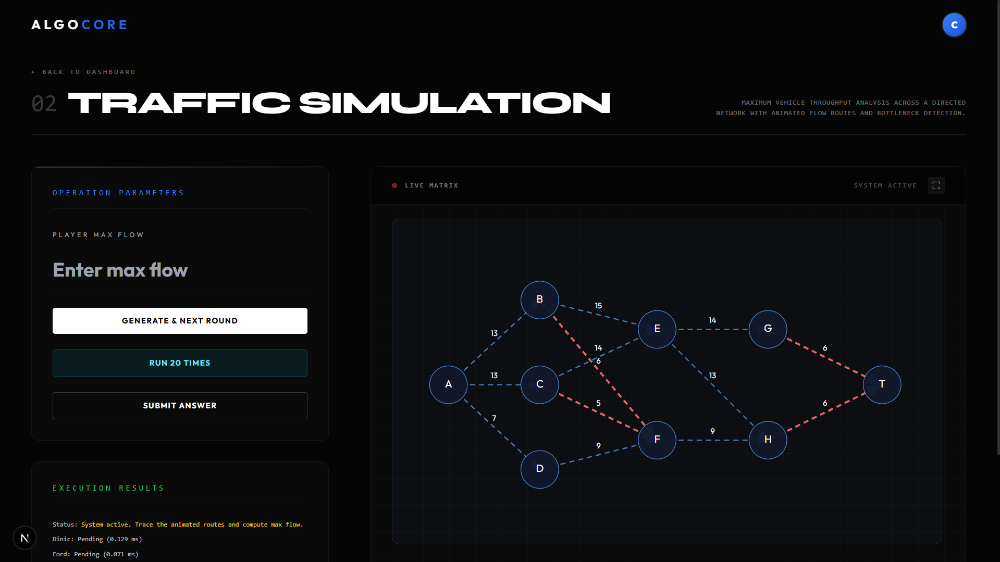
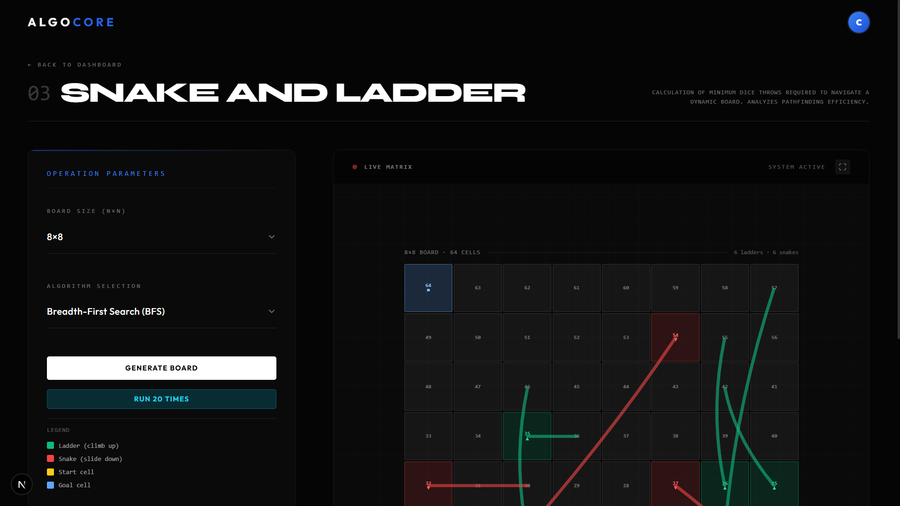
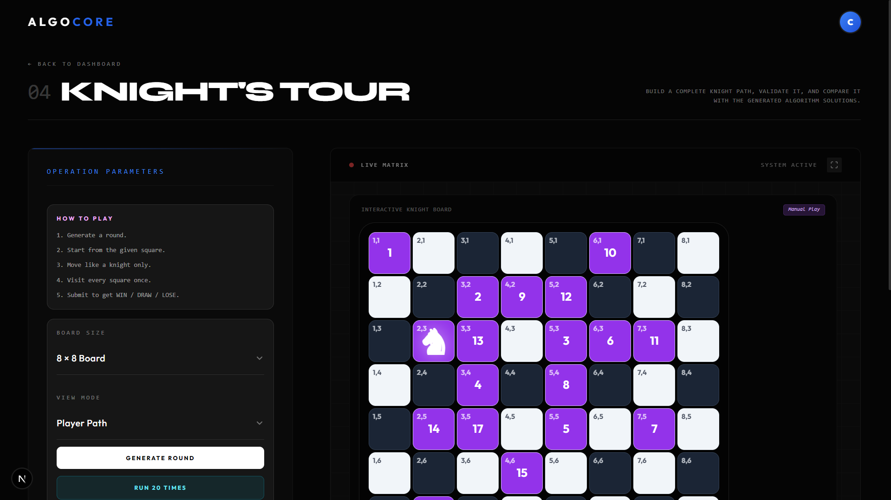
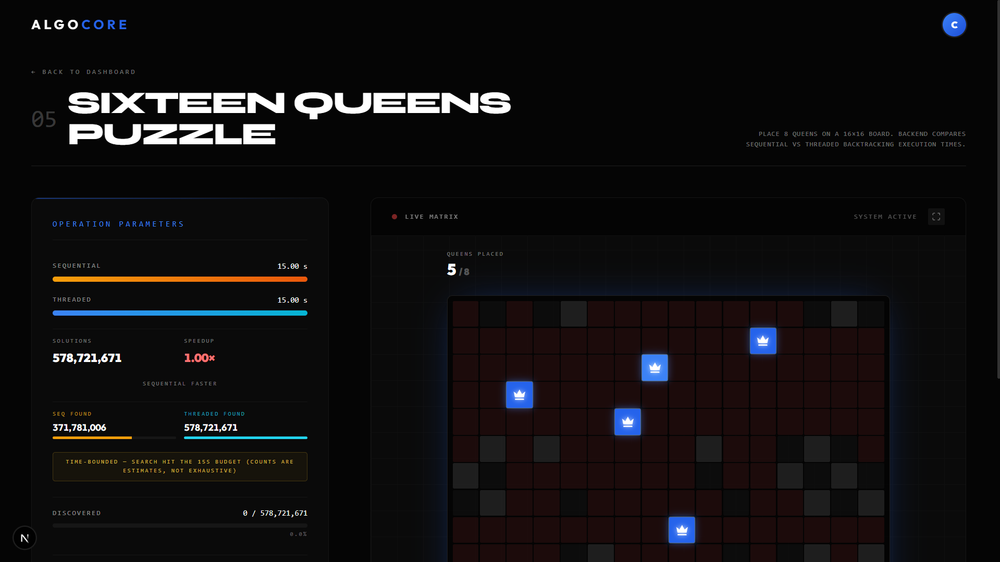

# ALGOCORE - Getting Started


This guide provides instructions on how to set up and run the ALGOCORE project locally.

## Prerequisites
- **Node.js** (v18 or higher)
- **Java** (JDK 17 or higher)
- **Maven**
- **MySQL Server**

---

## Frontend Interface Preview

Here is a visual walkthrough of the ALGOCORE frontend interface:

| | |
| :---: | :---: |
|  |  |
|  |  |

| |
| :---: |
|  |

---

## Interactive Algorithm Modules

### 01. Mincost Assignment
Optimize task-to-employee allocation using Greedy and Hungarian algorithms.


---

### 02. Traffic Simulation
Maximum vehicle throughput analysis across a directed network with animated flow routes and bottleneck detection.


---

### 03. Snake and Ladder
Calculation of minimum dice throws required to navigate a dynamic board. Analyzes pathfinding efficiency.


---

### 04. Knight's Tour
Build a complete knight path, validate it, and compare it with the generated algorithm solutions.


---

### 05. Sixteen Queens Puzzle
Place 8 queens on a 16x16 board. Backend compares sequential vs threaded backtracking execution times.


---

## 1. Backend Setup (Java Spring Boot)

1. **Navigate to the backend directory:**
   ```powershell
   cd games-backend
   ```

2. **Database Configuration:**
   - Create a MySQL database named `algocore_db`.
   - Create a `.env` file in the `games-backend` directory (refer to `.env.example`).
   - Define your credentials:
     ```env
     DB_USERNAME=your_username
     DB_PASSWORD=your_password
     ```

3. **Run the Backend:**
   Use the provided batch script for a quick start:
   ```powershell
   .\run-dev.bat
   ```
   Or manually using Maven Wrapper:
   ```powershell
   ./mvnw clean install
   ./mvnw spring-boot:run
   ```
   *The backend will be accessible at `http://localhost:9090`.*

---

## 2. Frontend Setup (Next.js)

1. **Navigate to the frontend directory:**
   ```powershell
   cd frontend
   ```

2. **Install Dependencies:**
   ```powershell
   npm install
   ```

3. **Start the Development Server:**
   ```powershell
   npm run dev
   ```

4. **Access the Application:**
   Open [http://localhost:3000](http://localhost:3000) in your browser.


